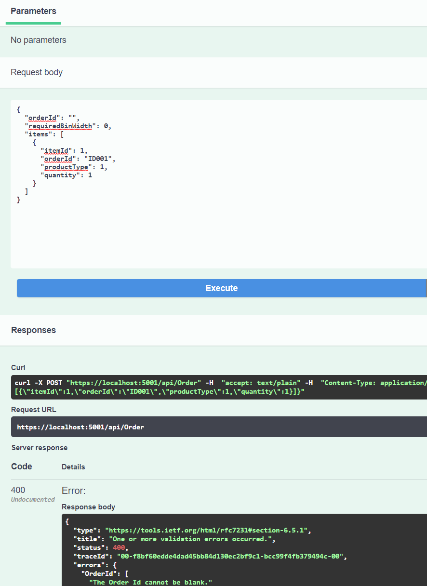
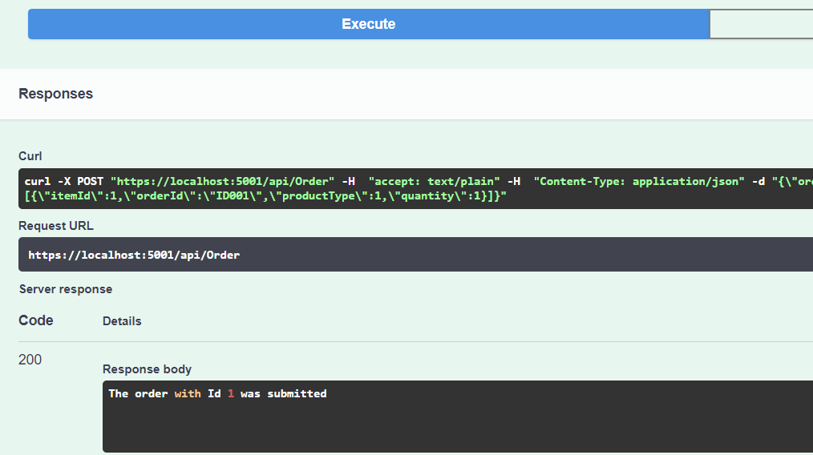

# engineer-assignment
Net Engineer Assigment 

## About the Projects
There is 2 project in the current solution:
- PhotoBookApi: This project contains the logic of the api, basically is the the code to be use
- PhotoBookApiTest: All projects should have at least basic test, the idea of this is avoid any potential issue in the actual functionality if the code is modified.

## Details about the assigment

The assigment was pretty clear: Create a .NET Web API that accepts an order, stores it, and responds with the minimum bin width. We also should be able to get back all the information that is known about the order by its ID.

Taking this in consideration this API only has 2 Actions:
- Get: Which is based on the order Id, will return you the order data. This contains the min width for the bin.
- Post: We are not updating records, we are creating a new order, for that reason the verb used here is Post.

## Architecture Decisions
Basically the structure of the projects is working under 3 leves:
- Controller: This is the exposed level, the idea is to keep it simple. NO BUSINESS logic or complex calculations should be done here. There is some rules applied to input parameters, for example order id is required, this is handle it by the model(Using fluent validation).

- Service: The idea is to have this intermedium label to validate any posible busines logic or complex calculation calling helpers. For this project the idea was to make the calculation of the width here, but to make it easy we did it on Database Access Level.

- Database Acces: This level is under Repositories, the idea is to create the mapping between all the parameters sent by users in the API to database structures, all the calls to inserts/get/update/delete should be done here.

Besides that, we are using dependency injection to call the repo from Services and Services from Controllers

### What else?
As we mentioned before, we are using Fluent Valition to check all the required values comes in the Request Object, you can review this under Models -> OrderValidator. More validations can be added, I just added basic.

This small appliation is using swagger, users should be able to run the application and browse the methods using this interface.

Aslo we added a basic health check for DB, you can access this one running the project and accesing the URL:
https://localhost:5001/health

The Test Project createa was more a concept, because a lot of scenarios are missing here. I just created the basic scenarios.

## How to run the API?
I developed all the project using Visual Studio Code, for that reason I will explain how to do it with it(yoou can do it by command line)
There is 2 projects in the current solution, you should choose the one with Name ".Net Core Launch(WEb)", after that just hit F5(debug mode) or CTRL + F5

When the project is running, go to your browser and type the following path.
URL:
https://localhost:5001/swagger/index.html

### Examples

Here are some examples of the execution.

Get no data found:

Order Id required on Post:

Success:

Note: At this point my knoledge about netcore is really basic, most of the time I'm been working in old .Net Framewor(mvc, web api). 
